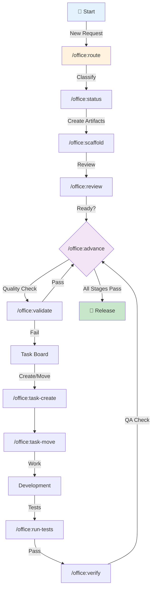
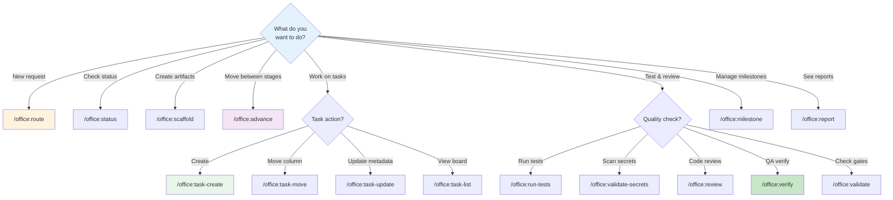
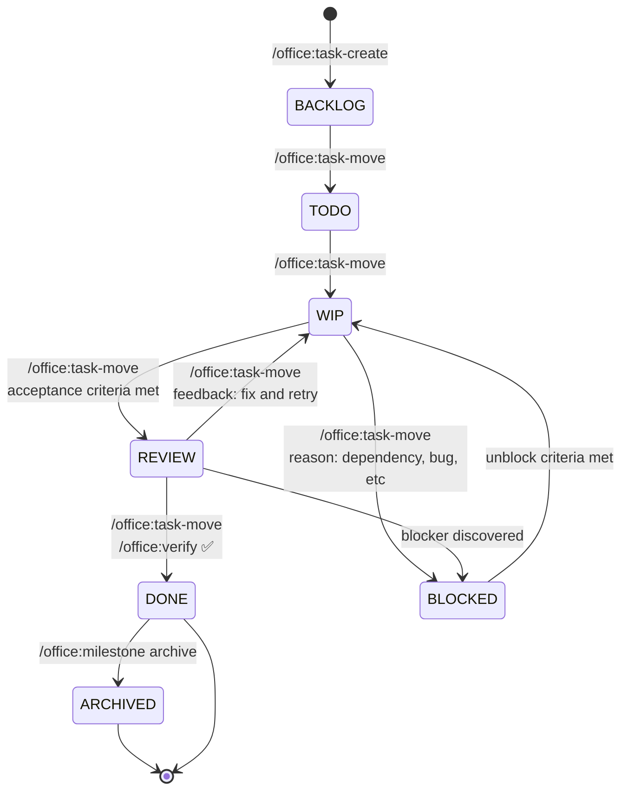
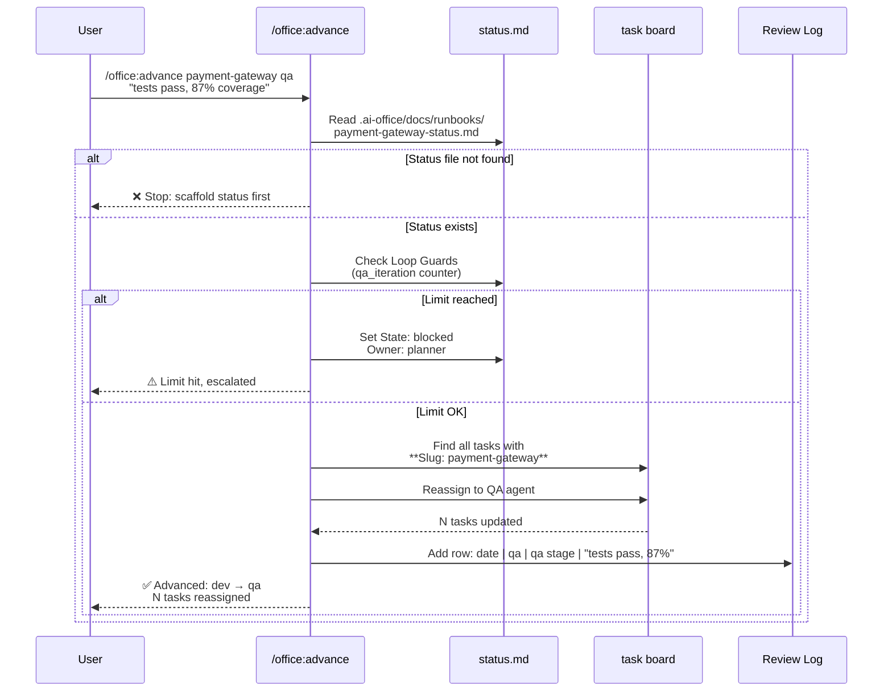
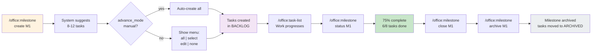
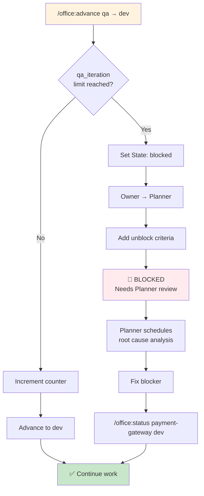

# AI Office — Multi-Agent Software Development Framework

A file-based virtual agency system for AI-assisted software development. Orchestrate 22 specialized agents through a structured pipeline with milestones, kanban task board, role-based guidance, code quality rules, and loop guards—all as Claude Code slash commands.

## 🎯 What It Does

**AI Office** manages the complete software development lifecycle:

- 📋 **Pipeline stages**: discussion → requirements → architecture → planning → implementation → QA → review → UAT → release → postmortem
- 👥 **22 specialized agents**: PM, architect, developer, designer, QA, security, reviewer, ops, and more
- 🗂️ **6 pre-built agencies**: software-studio, lean-startup, game-studio, creative-agency, media-agency, penetration-test-agency
- 📊 **Kanban board**: backlog, TODO, WIP, review, blocked, done, archived
- 🎯 **Milestone tracking**: auto-suggest tasks, measure velocity, track progress
- 🛡️ **Loop guards**: prevent infinite QA/review/UAT cycles (hard limits with escalation)
- 📝 **Artifacts**: PRD, ADR, runbooks, task board, status files—all markdown, all version-controlled

### Visual Overview


---

## 🚀 Quick Start

### 1. Install

```bash
# Install into a project
./install.sh [project-root]

# Then configure
./setup.sh [project-root]
```

The installer creates:
- `.claude/CLAUDE.md` — base quality rules (auto-loaded by Claude Code)
- `.claude/commands/office/` — 23 slash commands
- `.ai-office/` — framework engine (agents, agencies, configs, task board)

### 2. Configure

```bash
# Interactive setup wizard
/office:setup

# Or automatic with flags
./setup.sh . --agency=software-studio --stack=node-react --non-interactive
```

### 3. Start a Feature

```bash
/office:route Add user profile editing

# Creates discussion context, asks clarifying questions,
# suggests pipeline path, recommends first action
```

---

## 📚 Table of Contents

- [Commands Reference](#commands-reference)
- [What's New in v1.4.0](#whats-new-in-v140)
- [Directory Structure](#directory-structure)
- [Task Management](#task-management)
- [Pipeline & Stages](#pipeline--stages)
- [Milestone Workflow](#milestone-workflow)
- [Loop Guards](#loop-guards)
- [Agencies](#agencies)
- [Project Configuration](#project-configuration)
- [Base Rules (CLAUDE.md)](#base-rules-claudemd)
- [Updating](#updating)

---

## 📋 Commands Reference

### Command Flow Diagram



### Which Command Should I Use?



### Core Routing

| Command | Purpose |
|---------|---------|
| `/office:ai-office` | **Start here.** Interactive wizard to discover and execute commands step-by-step |
| `/office:route <request>` | Classify request type, run discussion phase, suggest pipeline path, create context |
| `/office:status <slug> [state] [owner] [notes]` | Get current pipeline status or update it |

### Pipeline Management

| Command | Purpose |
|---------|---------|
| `/office:advance <slug> <evidence> [next-stage]` | Advance to next stage, reassign tasks, check loop guards |
| `/office:validate <slug> <stage>` | Validate quality gates before advancing |
| `/office:scaffold <slug> <stage>` | Create artifact (discuss, prd, adr, plan, tasks, status, review, runbook) |

### Task Board

| Command | Purpose |
|---------|---------|
| `/office:task-create <title> [ms:M1] [priority:HIGH] [column:BACKLOG] [assignee:Developer] [estimate:4h] [labels:bug,auth] [slug:feature]` | Create new task with optional slug linking |
| `/office:task-move <task-id> <column> [reason]` | Move task (BACKLOG, TODO, WIP, REVIEW, BLOCKED, DONE, ARCHIVED) |
| `/office:task-update <task-id> [priority:] [assignee:] [estimate:] [labels:] [slug:]` | Update task metadata without moving |
| `/office:task-list [column] [ms:M1] [assignee:name]` | View kanban board (shows Labels and BLOCKED column) |

### Quality & Testing

| Command | Purpose |
|---------|---------|
| `/office:run-tests <slug>` | Run test suite, parse coverage, append results to status file |
| `/office:validate-secrets [path]` | Scan for hardcoded secrets, API keys, credentials, private keys |
| `/office:review <path> [sectors:technical,security,business,ux]` | Multi-sector code review with scoring |
| `/office:verify <task-id>` | QA verification: check acceptance criteria, diagnose failures, move to REVIEW if pass |

### Milestones & Reporting

| Command | Purpose |
|---------|---------|
| `/office:milestone create <id> <name> [target:YYYY-MM-DD] [tasks:yes\|no\|ask]` | Create milestone, auto-suggest tasks |
| `/office:milestone list\|status <id>\|close <id>\|archive <id>` | Manage milestone lifecycle |
| `/office:report <status\|investor\|tech-debt\|audit\|velocity>` | Generate project report |
| `/office:graph [package] [format:svg\|png\|html]` | Dependency tree visualization |

### Agent & Configuration

| Command | Purpose |
|---------|---------|
| `/office:role <agent-name>` | Display agent personality, competencies, stage-specific guidance |
| `/office:agency list\|get <name>\|select <name>` | Manage active agency |
| `/office:setup` | Reconfigure project (agency, tech stack, thresholds) |
| `/office:doctor` | Framework health check (directories, config, command count, integrity) |
| `/office:_meta` | Show version, check for updates |

### Utilities

| Command | Purpose |
|---------|---------|
| `/office:script list\|run\|create\|validate <name>` | Execute markdown runbooks |

---

## ✨ What's New in v1.4.0

### Breaking Changes
- **Task Slug field**: Tasks now include `**Slug:** <feature-slug>` to link to parent pipeline. `/office:advance` matches tasks via Slug first, then filename fallback.
- **Status file Loop Guards**: All status files now include `## Loop Guards` table (auto-heals if missing).
- **Version annotations**: All commands tagged with `<!-- ai-office-version: 1.4.0 -->` for smart per-file diffing in updates.

### New Features
- **BLOCKED column**: Tasks can now move to BLOCKED with required reason. `/office:task-list` and `/office:task-move` fully support it.
- **Task Labels in output**: `/office:task-list` now displays Labels column for better categorization visibility.
- **Velocity reporting**: New `/office:report velocity` shows tasks completed per milestone and per week (throughput metrics).
- **Discuss artifact**: `/office:scaffold <slug> discuss` creates discussion context docs (new `.ai-office/docs/context/<slug>.md` template).
- **Runbook artifact**: `/office:scaffold <slug> runbook` creates deployment/ops runbooks.
- **Task Slug parameter**: `/office:task-create` and `/office:task-update` now accept `slug:feature-name` to link tasks to pipeline features.
- **Better error handling**: `/office:advance` now stops with clear message if status file missing, suggests scaffolding.
- **User Acceptance in pipelines**: All relevant pipelines now include `review → user_acceptance → release` (not just `review → release`).

### Fixes
- `/office:verify` now recommends moving to REVIEW (not DONE) for proper workflow
- `/office:validate` sprint duration now concrete (14 days, not vague "a sprint")
- `/office:milestone archive` has explicit loop instructions for batch task processing
- `/office:status` SET mode now creates Loop Guards table (consistent with scaffold)
- Task matching in `/office:advance` more robust (Slug field + filename fallback)

---

## 📁 Directory Structure

### Visual Structure

```mermaid
graph TD
    ROOT["📦 project-root"]
    CLAUDE[".claude<br/>(Claude Code)"]
    AIOFFICE[".ai-office<br/>(Framework Engine)"]

    ROOT --> CLAUDE
    ROOT --> AIOFFICE

    CLAUDE --> CLAUDEMD["CLAUDE.md<br/>(base rules)"]
    CLAUDE --> COMMANDS["commands/office/<br/>(23 commands)"]

    AIOFFICE --> CONFIG["📋 Configs"]
    AIOFFICE --> TASKS["📊 Tasks<br/>(Kanban Board)"]
    AIOFFICE --> DOCS["📝 Docs<br/>(Artifacts)"]
    AIOFFICE --> AGENTS["👥 Agents<br/>(22 profiles)"]
    AIOFFICE --> AGENCIES["🏛️ Agencies<br/>(6 templates)"]
    AIOFFICE --> ADDONS["🔌 Addons<br/>(opt-in rules)"]

    CONFIG --> PROJECTCFG["project.config.md"]
    CONFIG --> AGENCYJSON["agency.json"]
    CONFIG --> MILESTONES["milestones/"]

    TASKS --> BACKLOG["BACKLOG/"]
    TASKS --> TODO["TODO/"]
    TASKS --> WIP["WIP/"]
    TASKS --> REVIEW["REVIEW/"]
    TASKS --> BLOCKED["BLOCKED/"]
    TASKS --> DONE["DONE/"]
    TASKS --> ARCHIVED["ARCHIVED/"]

    DOCS --> CONTEXT["context/"]
    DOCS --> PRD["prd/"]
    DOCS --> ADR["adr/"]
    DOCS --> RUNBOOKS["runbooks/"]

    ADDONS --> SUPABASE["supabase.md"]
    ADDONS --> REACT["frontend-react.md"]
    ADDONS --> BUN["bun-monorepo.md"]

    style ROOT fill:#e3f2fd
    style CLAUDE fill:#fff3e0
    style AIOFFICE fill:#f3e5f5
    style TASKS fill:#e8f5e9
    style DOCS fill:#ede7f6
```



### Detailed Structure

After install, your project has:

```
.claude/
├── CLAUDE.md                    ← Base quality rules (always active)
└── commands/
    └── office/                  ← 23 slash commands
        └── .version             ← Installed version stamp

.ai-office/
├── office-config.md             ← Agency identity & base config
├── project.config.md            ← Tech stack, thresholds, advance_mode
├── agency.json                  ← Active agency selection metadata
│
├── milestones/                  ← M1.md, M2.md, … (milestone definitions)
│
├── tasks/                       ← Kanban board
│   ├── BACKLOG/                 ← <MS>_T<NNN>-<slug>-<assignee>.md
│   ├── TODO/
│   ├── WIP/
│   ├── REVIEW/
│   ├── BLOCKED/                 ← NEW: unrealized tasks with blocker notes
│   ├── DONE/
│   ├── ARCHIVED/                ← Superseded or old tasks
│   └── README.md                ← Column counts (auto-updated)
│
├── docs/
│   ├── context/                 ← Discussion phase context (NEW in v1.4.0)
│   ├── prd/                     ← Product requirement docs
│   ├── adr/                     ← Architecture decision records
│   └── runbooks/                ← <slug>-plan.md, -tasks.md, -status.md, -review.md, -runbook.md
│
├── agents/                      ← 22 agent profiles
│   └── <agent>/
│       ├── personality.md
│       ├── competencies.md
│       ├── triggers.md
│       ├── workflows.md
│       ├── skills.md
│       └── mcp-adapters.md
│
├── agencies/                    ← 6 pre-built + custom agencies
│   └── <agency>/
│       ├── config.md
│       ├── pipeline.md
│       └── templates.md
│
├── templates/                   ← Document templates
│   ├── prd.md
│   ├── adr.md
│   ├── runbook-plan.md
│   └── qa-checklist.md
│
├── addons/                      ← Opt-in rules (uncomment in CLAUDE.md)
│   ├── typescript-naming.md
│   ├── supabase.md
│   ├── bun-monorepo.md
│   ├── frontend-react.md
│   ├── react-native.md
│   └── mcp-usage.md
│
├── scripts/                     ← Custom markdown runbooks
└── memory/                      ← Persistent context across sessions
```

---

## 📝 Task Management

### Task File Format

Tasks are named: `<MILESTONE>_T<NUMBER>-<TITLE-SLUG>-<ASSIGNEE>.md`

Example: `M1_T003-fix-upload-timeout-developer.md`

**Frontmatter fields:**

```markdown
# Task Title

**ID:** M1_T003                    ← Auto-generated task ID
**Milestone:** M1                  ← Milestone reference (M0 = unscheduled)
**Slug:** fix-upload              ← NEW: Parent feature slug for /office:advance matching
**Priority:** HIGH                ← HIGH | MEDIUM | LOW
**Status:** WIP                    ← BACKLOG | TODO | WIP | REVIEW | BLOCKED | DONE | ARCHIVED
**Assignee:** Developer           ← Agent or person name
**Labels:** bug,perf              ← NEW: Visible in /office:task-list output
**Dependencies:** M1_T001,M1_T002 ← Task IDs this depends on
**Created:** 2026-03-18
**Started:** 2026-03-18           ← Auto-set when moved to WIP
**Completed:** —                  ← Auto-set when moved to DONE
**Estimate:** 4h                  ← Time estimate
```

**Special notes:**

- `M0` is reserved for unscheduled/one-off tasks — no creation required
- All other milestones must exist before tasks can reference them
- **Slug field (NEW)** — used by `/office:advance` to find and reassign related tasks
- **Labels (NEW)** — categorization tags, visible in task-list output
- **BLOCKED column (NEW)** — requires a reason; `/office:task-list` shows it alongside other columns

### Task Lifecycle



**Legacy ASCII view:**
```
BACKLOG  →  TODO  →  WIP  →  REVIEW  →  DONE  →  ARCHIVED
           ↑                   ↑          ↑
           └─ Rework ──────────┘          │
                                          │
                              BLOCKED ←──┴─ (blocker found)
```

### Creating Tasks with Slug

```bash
# Via route → milestone → task-create flow
/office:route Implement payment gateway

# Then when creating tasks:
/office:task-create Process refunds ms:M1 priority:HIGH \
  assignee:Developer estimate:6h labels:billing,payment \
  slug:payment-gateway

# Later, /office:advance payment-gateway qa <evidence>
# will find and reassign this task automatically
```

---

## 🔄 Pipeline & Stages

### Standard Pipeline (Software Studio)

```mermaid
graph LR
    ROUTER["🔀 router<br/>Request classifier"]
    PRD["📋 prd<br/>PM creates requirements"]
    ADR["🏗️ adr<br/>Architect decides"]
    PLAN["📊 plan<br/>Planner breaks down"]
    TASKS["🎯 tasks<br/>Task files created"]

    UX["🎨 ux_research<br/>User research"]
    DESIGN["🖼️ design_ui<br/>UI design"]

    DEV["👨‍💻 dev<br/>Implementation"]
    SEC["🔒 security<br/>Security review"]
    QA["🧪 qa<br/>QA testing"]

    REVIEW["👁️ review<br/>Code review"]
    UAT["✅ user_acceptance<br/>UAT sign-off"]
    RELEASE["🚀 release<br/>Deploy"]
    POST["📖 postmortem<br/>Learnings"]

    ROUTER --> PRD
    PRD --> ADR
    ADR --> PLAN
    PLAN --> TASKS

    TASKS --> UX
    TASKS --> DEV
    UX --> DESIGN
    DESIGN --> DEV

    DEV --> SEC
    DEV --> QA
    SEC --> REVIEW
    QA --> REVIEW

    REVIEW --> UAT
    UAT --> RELEASE
    RELEASE --> POST

    style ROUTER fill:#e3f2fd
    style DEV fill:#f3e5f5
    style REVIEW fill:#e8f5e9
    style RELEASE fill:#c8e6c9
```



**Legacy ASCII view:**
```
router → prd → adr → plan → tasks ──┬→ ux_research → design_ui ─┐
                                    │                           ↓
                                    └→ dev ←─────────────────────┘
                                     ├→ security
                                     └→ qa
                                      ↓ ↓ ↓
                                      review → user_acceptance → release → postmortem
```

### Stage Transitions via /office:advance



**Example:**

```bash
/office:advance payment-gateway qa "all tests pass, coverage 87%"
```

This:
1. ✅ Validates status file exists (or stops with helpful message)
2. 🛡️ Checks loop guards (qa_iteration counter)
3. 🔀 Moves to QA stage
4. 🎯 Finds all tasks with `**Slug: payment-gateway**`
5. 👤 Reassigns them to the QA agent
6. 📊 Adds evidence to the Review Log
7. 🔒 In `manual` mode: pauses for confirmation before commit

---

## 🎯 Milestone Workflow

### Milestone Lifecycle



### Create and Generate Tasks

```bash
# Create a milestone — system suggests ~8 tasks
/office:milestone create M1 "Auth & Onboarding" target:2026-04-01

# Or create without prompting (auto-generate all suggested tasks)
/office:milestone create M2 "Billing" target:2026-05-01 tasks:yes

# Or create milestone only, no tasks
/office:milestone create M3 "Performance" tasks:no
```

When `tasks:ask` (default) and `advance_mode: manual`, you see:

```
Suggested tasks (8):
| # | Title | Assignee | Priority | Estimate |
|---|-------|----------|----------|----------|
| 1 | Create auth table + RLS | developer | high | 2h |
| 2 | Implement login endpoints | developer | high | 3h |
...

Create these tasks? Options:
  all      — create all 8
  select   — choose which ones (e.g. "1 2 3 5")
  edit     — adjust each one before creating
  none     — skip, create manually
```

### Check Progress

```bash
/office:milestone status M1

# Output:
# Milestone M1: Auth & Onboarding
# Target: 2026-04-01 · Status: active
# Progress: ████████░░ 6/8 tasks done (75%)
# By priority:
#   HIGH    4/5 done  ████░
#   MEDIUM  2/3 done  ██░
# Labels in use: auth, frontend, bug
# ...
```

### Velocity Tracking (NEW)

```bash
/office:report velocity

# Output:
# ## Tasks Completed by Milestone
# | Milestone | Total Done | HIGH | MEDIUM | LOW |
# | M1        | 12         | 8    | 3      | 1   |
# | M2        | 5          | 2    | 2      | 1   |
#
# ## Weekly Throughput (last 4 weeks)
# | Week       | Tasks Completed |
# | week 1     | 6               |
# | week 2     | 8               |
# | week 3     | 5               |
# | week 4     | 4               |
#
# Avg throughput: 5.75 tasks/week
```

### Close & Archive

```bash
# Close a milestone (marks complete, but keeps tasks accessible)
/office:milestone close M1

# Archive (hides from active view, moves remaining tasks to ARCHIVED)
/office:milestone archive M1
```

---

## 🛡️ Loop Guards

Loop guards prevent infinite dev↔QA↔review cycles. Each status file tracks:

```markdown
## Loop Guards

| Guard | Count | Max |
|-------|-------|-----|
| qa_iteration | 2 | 2 |
| review_iteration | 1 | 2 |
| uat_iteration | 0 | 1 |
```

### How Loop Guards Work



**Behavior:**

| Transition | Limit | Escalation |
|-----------|-------|-----------|
| QA → dev (regression) | 2 | Set to `blocked`, owner → Planner |
| Review → dev (revision) | 2 | Set to `blocked`, owner → Planner |
| UAT → dev (user acceptance) | 1 | Set to `blocked`, owner → Planner |

### Example: Loop Guard Triggers

```
Iteration 1: qa → dev → qa (fix tests) → qa → dev → qa (fix again)
Iteration 2: qa → dev (final fix attempt)
Iteration 3: ❌ qa_iteration limit (2) reached!

⚠️  Task set to BLOCKED
Reassigned to: Planner
Unblock criteria: Root cause analysis meeting required before dev resumes

→ Planner investigates root cause
→ Team decides: architecture issue, not just test flake
→ /office:status payment-gateway blocked → adr (escalate to Architect)
```

The owner (Planner) must explicitly unblock by setting a new stage or unblock criteria.

---

## 🏛️ Agencies

Six pre-built agencies for different team structures and project types:

| Agency | Best for | Active agents | Key traits |
|--------|----------|---------------|-----------|
| **software-studio** | Full-stack SaaS / web apps | 13 | Complete SDLC, all quality gates, CEO approval, security review |
| **lean-startup** | Rapid MVP / startup | 7 | Minimal process, quick feedback loops, fast iteration |
| **game-studio** | Games & interactive | Custom | Playtesting, balance, creative reviews |
| **creative-agency** | Media & content production | Audio/video/image creators | Asset production, creative review cycle |
| **media-agency** | Film & video production | Video creator focus | Pre-production → production → post |
| **penetration-test-agency** | Security testing | Security specialist lead | Pentest workflow, audit reports |

### Create Custom Agency

```bash
./create-agency.sh my-team --from=software-studio --name="My Custom Agency" --desc="Optimized for our team"

# New agency appears in /office:setup menu automatically (dynamic discovery)
```

---

## ⚙️ Project Configuration

`setup.sh` creates `.ai-office/project.config.md` with YAML frontmatter:

```yaml
---
agency: software-studio
project_name: my-app

# Build & test commands (with fallbacks in parentheses)
typecheck_cmd: "npm run typecheck"
lint_cmd: "npm run lint"
test_cmd: "npm run test"
test_runner: vitest

# Frontend (optional)
ui_framework: react
design_system: shadcn/ui

# Quality thresholds
coverage_min: 80
lighthouse_min: 90

# Pipeline behavior
advance_mode: manual    # manual = pause for confirmation, auto = proceed
---
```

### Stack Presets

```bash
./setup.sh . --stack=node-react
./setup.sh . --stack=python-fastapi
./setup.sh . --stack=go
./setup.sh . --stack=mobile-rn
```

Each preset auto-fills test commands, linters, UI framework, etc.

### advance_mode

- **`manual`** (default) — `/office:advance` pauses and asks for confirmation before transitioning
  - Ideal for careful workflows where you review changes before advancing
  - `advance_mode: manual` + `milestone create M1 tasks:ask` = full interactive workflow

- **`auto`** — `/office:advance` validates and transitions immediately without prompting
  - Ideal for CI/CD integration or high-trust workflows

---

## 📖 Base Rules (CLAUDE.md)

`install.sh` places `.claude/CLAUDE.md` — Claude Code loads this automatically every session. It encodes:

### Always-On Rules

| Area | Rules |
|------|-------|
| **Reasoning** | Confirm understanding, verify APIs, minimal diffs, no hallucinated code |
| **Code Quality** | SOLID principles, DRY with judgment, pure functions, descriptive names |
| **TypeScript** | Strict mode, no `any`, no unsafe casts, `instanceof` in catch |
| **Security** | No secrets, parameterized queries, least privilege, idempotency keys |
| **Git** | Conventional Commits, lint/typecheck before committing |
| **AI Office** | Always `/office:route` first, record evidence before advancing, use artifacts |
| **Tasks** | Immediate state transitions, required update formats, README count sync |
| **Loop Guards** | Enforce QA/review/UAT iteration limits (hard stops with escalation) |

### Opt-in Addons

To activate project-specific rules, uncomment in `.claude/CLAUDE.md`:

```markdown
@.ai-office/addons/supabase.md
@.ai-office/addons/frontend-react.md
@.ai-office/addons/typescript-naming.md
```

Available addons:

| Addon | Coverage |
|-------|----------|
| `typescript-naming.md` | File naming, identifier casing, async/boolean prefixes |
| `supabase.md` | RLS policies, migrations, Edge Functions, pgTAP testing |
| `bun-monorepo.md` | Bun runtime, workspace protocol, monorepo layout |
| `frontend-react.md` | Component structure, state management, a11y, performance |
| `react-native.md` | Expo, SecureStore, navigation, Hermes optimization |
| `mcp-usage.md` | MCP tool preferences, Claude API integration |

---

## 📦 Requirements

- **[Claude Code](https://claude.ai/code)** — IDE integration and CLI
- **Bash** — macOS / Linux / WSL (for install/setup/update scripts)

---

## 🔄 Updating

Check for updates:

```bash
/office:_meta
# Output: Framework v1.3.0 installed, v1.4.0 available. Run ./update.sh

# Or manually
./update.sh [project-root]
```

Updates are **smart**: only changed files are updated (per-file version diffing). Your `.ai-office/` config and tasks are never touched.

---

## 📊 Typical Workflow

### Feature Request → Production (Timeline)

```mermaid
gantt
    title Feature: Real-time Notifications (M1)
    dateFormat YYYY-MM-DD

    section Discovery
    Route & Discuss           :route, 2026-03-20, 1d
    Create PRD                :prd, 2026-03-21, 2d

    section Design
    Architecture (ADR)        :adr, 2026-03-23, 1d
    Planning & Tasks          :plan, 2026-03-24, 2d

    section Development
    Implementation            :dev, 2026-03-26, 5d
    Security Review           :sec, 2026-03-26, 5d
    Unit Tests                :test, 2026-03-26, 5d

    section Quality
    QA Verification           :qa, 2026-03-31, 2d
    Code Review               :review, 2026-04-02, 2d
    UAT Sign-off              :uat, 2026-04-04, 1d

    section Release
    Production Deploy         :release, 2026-04-05, 1d
    Postmortem                :post, 2026-04-06, 1d

    milestone Shipping to prod, 2026-04-05, 0d
```

### Day 1: New Feature Request

```bash
# 1. Route the request
/office:route Add real-time notifications

# 2. System creates discussion context, asks 5 questions, suggests pipeline
# → Output: Type: New feature | Pipeline: discuss→prd→adr→plan→tasks→dev→qa→verify→review→release

# 3. Create PRD
/office:scaffold notifications prd

# 4. Create status file
/office:scaffold notifications status

# 5. Check the PRD
/office:review .ai-office/docs/prd/notifications.md

# 6. Advance to PRD stage (CEO approval)
/office:advance notifications "PRD complete and reviewed"
```

### Day 2: Architecture

```bash
# 1. Create ADR
/office:scaffold notifications adr

# 2. Advance to ADR stage
/office:advance notifications "Architecture decided: Redis pub/sub + WebSocket server"
```

### Day 3-5: Planning & Implementation

```bash
# 1. Create milestone with auto-suggested tasks
/office:milestone create M1 "Real-time notifications" tasks:yes

# 2. View kanban board
/office:task-list

# 3. Implement (developer picks up tasks, moves WIP → REVIEW)
/office:task-move M1_T001 WIP
# ... develop ...
/office:task-move M1_T001 REVIEW "acceptance criteria met"

# 4. QA verifies
/office:verify M1_T001

# 5. Once all tasks done, run tests
/office:run-tests notifications

# 6. Code review
/office:review src/notifications/ sectors:technical,security

# 7. Advance through remaining stages
/office:advance notifications qa "all tests pass"
/office:advance notifications review "code review approved"
/office:advance notifications user_acceptance "UAT sign-off"
/office:advance notifications release "deployed to production"
```

### End of Sprint: Reporting

```bash
# 1. Check status
/office:milestone status M1

# 2. Measure velocity
/office:report velocity

# 3. Audit health
/office:report audit

# 4. Close milestone
/office:milestone close M1
/office:milestone archive M1
```

---

## 🤝 Contributing

The framework is in active development. File structure, command signatures, and agent profiles are subject to change before v2.0.

---

## 📄 License

See LICENSE file.
