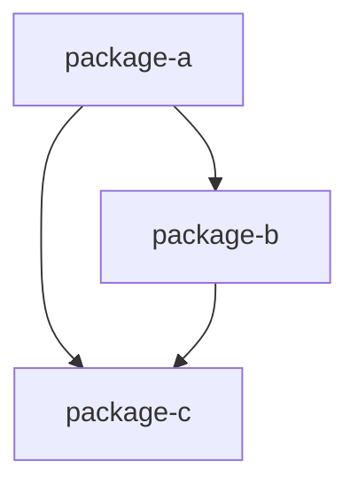

## Steps

1. **Determine scope**:
   - No package arg → auto-detect repo structure: look for `apps/`, `packages/`, `src/` directories. List what's found.
   - Package arg → focus on that directory

2. **Read `package.json` files** in scope to extract declared `dependencies` and `devDependencies`.

3. **Scan source files** (`.ts`, `.tsx`, `.js`, `.jsx`, `.py`, `.go`, `.rs`, `.java`) for cross-package imports:
   - Internal workspace imports (relative paths `../` or workspace package names from `package.json`)
   - External dependencies (npm / pip / cargo packages)
   - Flag any circular dependencies (A imports B imports A)

4. **Produce output**:

### Mermaid format
```
## Dependency Graph



## Analysis
- **Packages / apps**: list
- **Cross-package dependencies**: list edges
- **Top external deps**: top 5 by usage count
- **Circular dependencies**: ⚠️ list any, or ✅ None detected

## Complexity
- Files scanned: N
- Import edges: N
- Complexity score: N (rough estimate: sum of file sizes / 10)
```

### List format
Plain text, one relationship per line: `source → target`

---

5. **Recommendations** based on findings:
   - Circular deps → flag and suggest which direction to break
   - High fan-in package → note as a shared dependency, changes are high-risk
   - Zero-dependent packages → may be dead code or entry points
